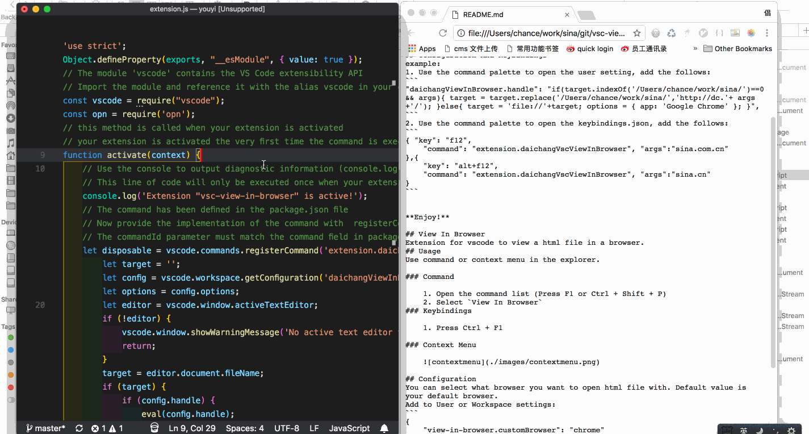

# Vsc View In Browser
Extendsion for preview the opened html file in the default browser.

# Usage

1. Bring up [command palette](https://code.visualstudio.com/docs/getstarted/userinterface#_command-palette) 
2. Type 'View In Browse' and select the item.

## Configuration And Keybindings
example:
1. Use the command palette to open the user setting, add the follows:
```
"daichangViewInBrowser.handle": "if(target.indexOf('/Users/chance/work/sina/')==0 && args){ target = target.replace('/Users/chance/work/sina/','http://dc.'+ args +'/'); }else{ target = 'file://'+target; options = { app: 'Google Chrome' }; }",
```
2. Use the command palette to open the keybindings.json, add the follows:
```
{ "key": "f12",
    "command": "extension.daichangVscViewInBrowser", "args":"sina.com.cn"
},{ 
    "key": "alt+f12",
    "command": "extension.daichangVscViewInBrowser", "args":"sina.cn"
}
```


**Enjoy!**
